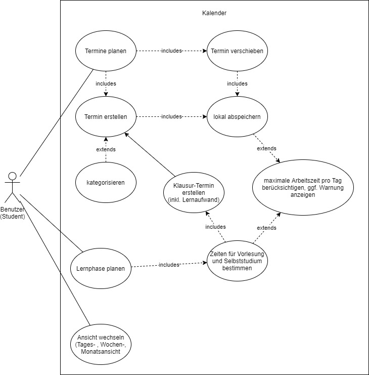

# PlanIt - Software Requirements Specification 

## Table of contents
- [Table of contents](#table-of-contents)
- [Introduction](#1-introduction)
    - [Purpose](#11-purpose)
    - [Scope](#12-scope)
    - [Definitions, Acronyms and Abbreviations](#13-definitions-acronyms-and-abbreviations)
    - [References](#14-references)
    - [Overview](#15-overview)
- [Overall Description](#2-overall-description)
    - [Vision](#21-vision)
    - [Use Case Diagram](#22-use-case-diagram)
	- [Technology Stack](#23-technology-stack)
- [Specific Requirements](#3-specific-requirements)
    - [Functionality](#31-functionality)
    - [Usability](#32-usability)
    - [Reliability](#33-reliability)
    - [Performance](#34-performance)
    - [Supportability](#35-supportability)
    - [Design Constraints](#36-design-constraints)
    - [Online User Documentation and Help System Requirements](#37-on-line-user-documentation-and-help-system-requirements)
    - [Purchased Components](#purchased-components)
    - [Interfaces](#39-interfaces)
    - [Legal, Copyright And Other Notices](#311-legal-copyright-and-other-notices)
- [Supporting Information](#4-supporting-information)

## 1. Introduction

### 1.1 Purpose
This Software Requirements Specification (SRS) describes all specifications for the application “PlanIt”. It includes an overview about this project and its vision, detailed information about the planned features and boundary conditions of the development process.

### 1.2 Scope
The project is going to be realized as a web-application, data will be stored locally.

There will be no different categories of users.
 
Planned Subsystems are: 
* Calendar Board:  
The calendar board is the essential part of the user interface. Appointments and learning sessions should be visualized as postings including relevant information about the session. Those should be partly standardized by a form with a free text option for specifics.
* Different types of events: 
User can insert an appointment into the calendar, to gain an overview of incoming events.

### 1.3 Definitions, Acronyms and Abbreviations
| Abbrevation | Explanation                            |
| ----------- | -------------------------------------- |
| SRS         | Software Requirements Specification    |
| UCD         | Use Case Diagram                       |
| FAQ         | Frequently Asked Questions             |

### 1.4 References

| Title                                                              | Date       | Publishing organization   |
| -------------------------------------------------------------------|:----------:| ------------------------- |
| [PlanIt Blog](https://planit2021se.wordpress.com/)                 | __.__.____ | PlanItTeam                |
| [GitHub](https://github.com/PatrickFreyy/PlanIt)                   | __.__.____ | PlanItTeam                |

### 1.5 Overview
The following chapter provides an overview of this project with vision and Overall Use Case Diagram. The third chapter (Requirements Specification) delivers more details about the specific requirements in terms of functionality, usability and design parameters. Finally there is a chapter with supporting information.

## 2. Overall Description

### 2.1 Vision
PlanIt will be a tool like a calendar. The main difference between our project and other usual calendar will be an exam planer. Not only will users set up new appointments and have a plan for the day, but they will also be able to plan their exam preparation. By entering the date and number and length of lectures, PlanIt suggests a time schedule for the exam preparation.

### 2.2 Use Case Diagram
 

### 2.3 Technology Stack
Technologies we use:

Backend: Java

Frontend: JavaScript [Framework missing]

IDE: Visual Studio Code

Project Management: YouTrack, GitHub, Wordpress

## 3. Specific Requirements

### 3.1 Functionality
This section will explain the different use cases, you could see in the Use Case Diagram, and their functionality.  
Until December we plan to implement:
* Calender with different views
* Appointments
* Add/remove
* Warning, if there is no break
* Allow to add description to the appointment
* Implement categories

Until June, we want to implement:
* Learn planning
* Exam date input
* Time between learn periods input
* Add time when user want to learn
* Allow manual changes
* Find free slots to learn
* Breaks between different appointements

### 3.2 Usability
#### 3.2.1 Intuitive User Guidance
We plan on designing the user interface as intuitive and self-explanatory as possible to make the user feel as comfortable as possible using the web-app. 

#### 3.2.2 FAQ
We implement a FAQ to help the user on using the web-application.

### 3.3 Reliability

#### 3.3.1 Server Availability
The website servers should always be available so the user has always access to his schedule.

### 3.4 Perfomance
Due to small size of the application, we don't focus on performance.
### 3.5 Supportability

#### 3.5.1 Coding Standards
We are going to write the code by using all of the most common clean code standards. For example we will name our variables and methods by their functionalities. This will keep the code easy to read by everyone and make further development much easier.

### 3.6 Design Constraints
Our focus is to build a modern application with modern technologies.

### 3.7 On-line User Documentation and Help System Requirements
We focus on building an intuitive modern-looking web-application to allow users to use our website without problems. We also implement an "FAQ" that contains instructions on how to use the application, features and leave our contacts for possible questions.

### 3.8 Purchased Components
We don't have any purchased components yet. If there will be purchased components in the future we will list them here.

### 3.9 Interfaces

#### 3.9.1 User Interfaces
The users could enter their appointments on a schedule, which is shown on the web-application.

#### 3.9.2 Persitence Interfaces
Controller parses data to persistence interface where the user could make their input. 

### 3.10 Legal, Copyright, and Other Notices
The logo is licensed to the PlanIt Team and is only allowed to use for the application. We do not take responsibility for any incorrect data or errors in the application.

## 4. Supporting Information
For more information you can contact us through our [blog](https://planit2021se.wordpress.com/). 

<!-- Picture-Link definitions: -->
[OUCD]: https://github.com/PatrickFreyy/PlanIt/blob/main/docs/UseCaseDiagram.png "Overall Use Case Diagram"
